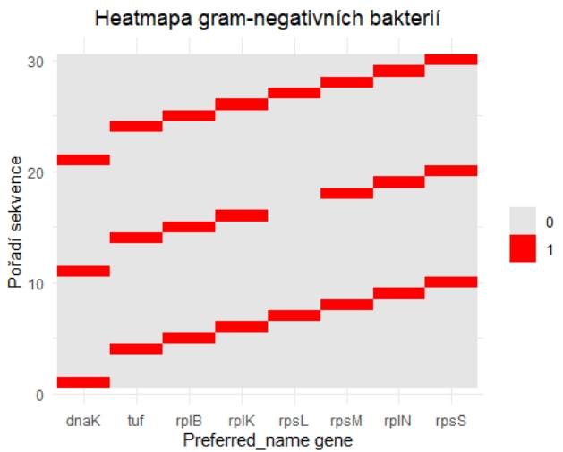

# Metagenomic Analysis of the Gastrointestinal Tract of Domestic Chicken

## Project Description

This project focuses on the metagenomic analysis of the microbiome in the gastrointestinal tract of domestic kuru using data available on NCBI under accession number PRJNA377666.

## Input Data

The input data consists of two CSV files:

- **Pos_EggnogMapper_Output.csv** – Contains information on metagenomic sequences obtained from gram-positive bacteria.
- **Neg_EggnogMapper_Output.csv** – Contains information on metagenomic sequences obtained from gram-negative bacteria.

Both files include gene annotations and their assignment to individual COG categories.

## Analysis Workflow

### Identification of COG Categories

Use the online tool **Eggnog-mapper** to determine COG categories for protein sequences separately for gram-positive and gram-negative bacteria.

### Visualization of COG Categories

Create a bar chart displaying the sums of individual COG categories for both gram-positive and gram-negative bacteria.

- Use the **R programming language** to calculate the sums of individual categories.
- Generate the bar chart using any preferred software.

### Gene Overlap Analysis

- Extract the **“Preferred_name gene”** from the Eggnog-mapper data.
- Identify the intersection of these genes between gram-positive and gram-negative bacteria using **R**.

### Heatmap of Overlapping Genes

- Create a heatmap for the top 30 sequences of **“Preferred_name gene”**.
- The x-axis represents individual genes, while the y-axis represents sequence order.
- Use **R programming language** for visualization.

## Project Outputs

- **COG Category Graph**: A bar chart representing the sums of COG categories.
  
- **Heatmap of Overlapping Genes**: A visualization of the gene intersection between gram-positive and gram-negative bacteria.
  
  

## Discussion

In this discussion, we focus on the differences in the distribution of COG categories between gram-positive and gram-negative bacteria, providing essential insights into their biological significance. COG categories are classified based on orthologous genes, which share a common ancestor and maintain their function across different organisms.

The analysis revealed that the most represented COG category in both bacterial types was **Category J**, responsible for translation, ribosomal structure, and biogenesis. In gram-positive bacteria, this category appeared approximately **2000 times**, while in gram-negative bacteria, it appeared around **250 times**. This difference in occurrence may indicate distinct evolutionary pressures or adaptations within these two bacterial groups.

Another significant aspect of the study was the comparison of gene overlap between gram-positive and gram-negative bacteria, where **8 common genes** were identified. The heatmaps displaying the occurrence of these genes in the first **30 sequences** provide a clear view of how these genes are distributed among different bacteria. In gram-positive bacteria, the most frequently present genes were **dnaK** and **tuf**, suggesting that these genes may play a crucial role in their biological processes. In gram-negative bacteria, these genes appeared three times, with only **rpsL** being present twice.

The primary reason for distinguishing bacteria into gram-positive and gram-negative groups lies in their **differences in cell membrane structure**, which influence **horizontal gene transfer**. This mechanism is vital for evolution as it allows bacteria to acquire new traits that enhance their survival and contribute to adaptation to new conditions. The acquired genetic information can then be transferred to subsequent generations, playing a key role in the evolutionary process.

This research demonstrates that conserved genes among gram-positive and gram-negative bacteria have significant biological functions, highlighting their shared evolutionary and adaptive mechanisms.

  

## Tools Used

- **Eggnog-mapper**: For COG category identification and **“Preferred_name gene”** extraction.
- **R**: For calculating COG category sums, finding gene intersections, and creating the heatmap.
- **Graphing Software**: For visualizing the bar chart and heatmap.
