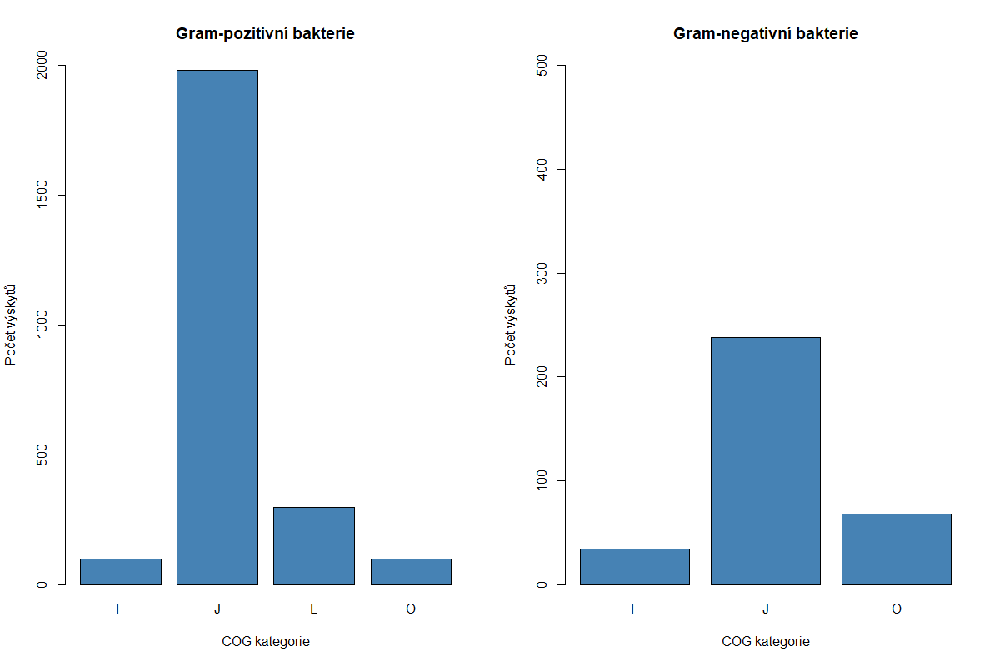
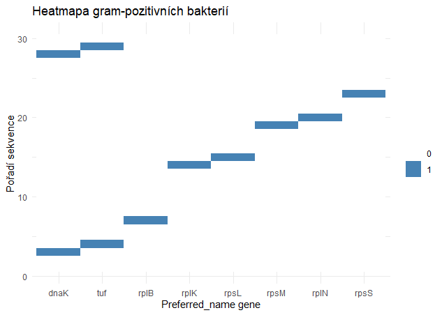

# Metagenomic Analysis of the Gastrointestinal Tract of Domestic Kuru

## Project Description

This project focuses on the metagenomic analysis of the microbiome in the gastrointestinal tract of domestic kuru using data available on NCBI under accession number PRJNA377666.

## Input Data

The input data consists of two CSV files:

- **Pos_EggnogMapper_Output.csv** – Contains information on metagenomic sequences obtained from gram-positive bacteria.
- **Neg_EggnogMapper_Output.csv** – Contains information on metagenomic sequences obtained from gram-negative bacteria.

Both files include gene annotations and their assignment to individual COG categories.

## Analysis Workflow

### Identification of COG Categories

Use the online tool **Eggnog-mapper** to determine COG categories for protein sequences separately for gram-positive and gram-negative bacteria.

### Visualization of COG Categories

Create a bar chart displaying the sums of individual COG categories for both gram-positive and gram-negative bacteria.

- Use the **R programming language** to calculate the sums of individual categories.
- Generate the bar chart using any preferred software.

### Gene Overlap Analysis

- Extract the **“Preferred_name gene”** from the Eggnog-mapper data.
- Identify the intersection of these genes between gram-positive and gram-negative bacteria using **R**.

### Heatmap of Overlapping Genes

- Create a heatmap for the top 30 sequences of **“Preferred_name gene”**.
- The x-axis represents individual genes, while the y-axis represents sequence order.
- Use **R programming language** for visualization.

## Project Outputs

- **COG Category Graph**: A bar chart representing the sums of COG categories.
  
- **Heatmap of Overlapping Genes**: A visualization of the gene intersection between gram-positive and gram-negative bacteria.
  
  

  

## Tools Used

- **Eggnog-mapper**: For COG category identification and **“Preferred_name gene”** extraction.
- **R**: For calculating COG category sums, finding gene intersections, and creating the heatmap.
- **Graphing Software**: For visualizing the bar chart and heatmap.
